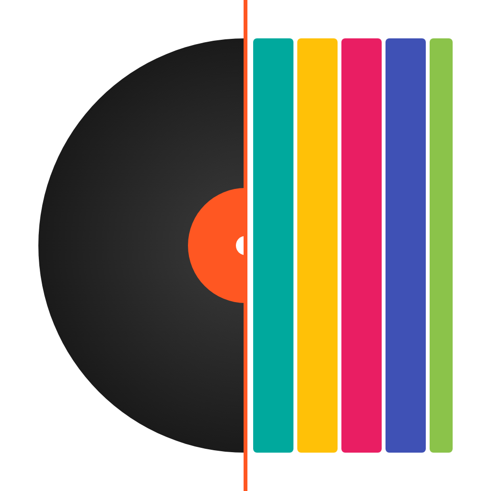
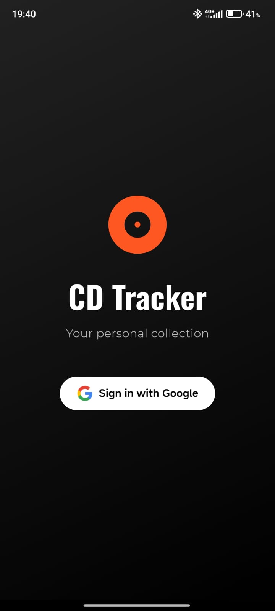
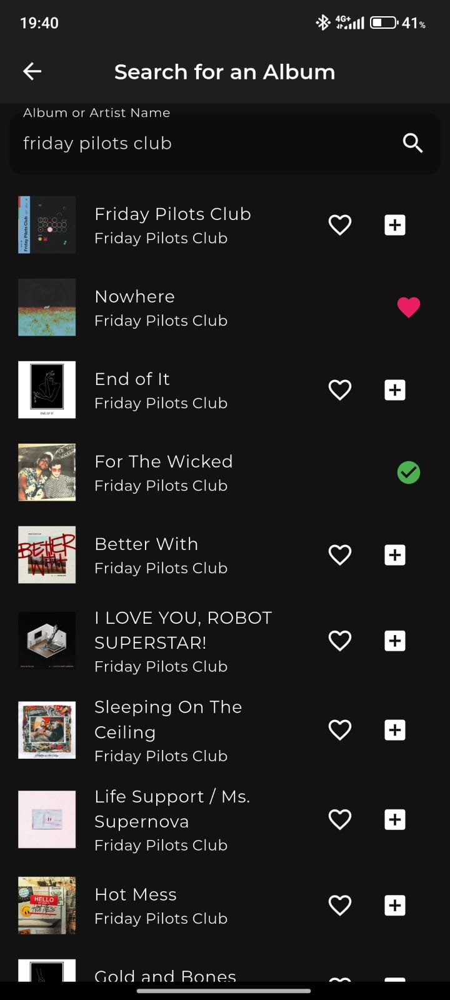
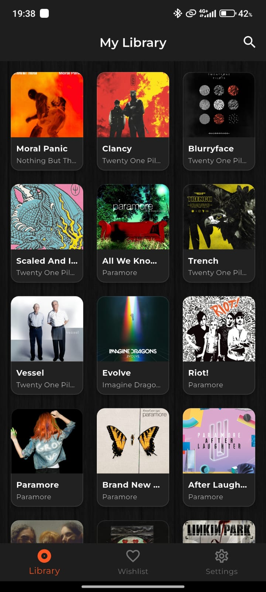
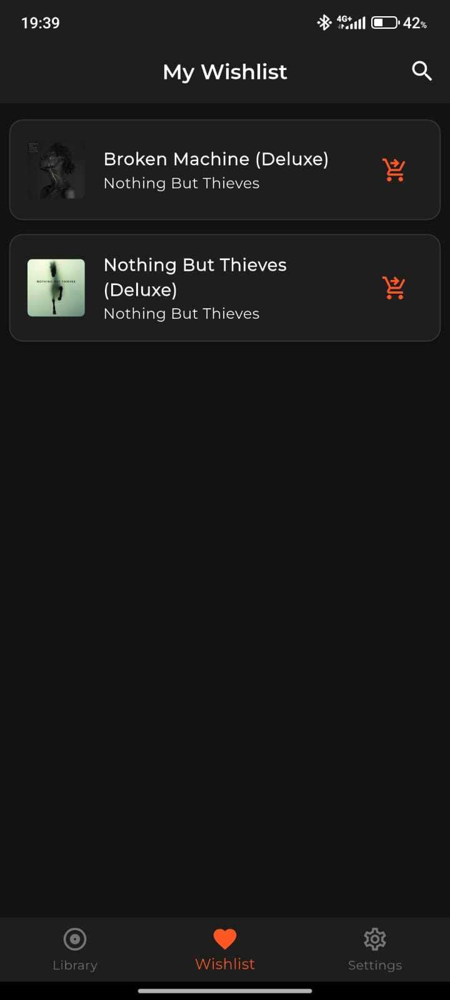
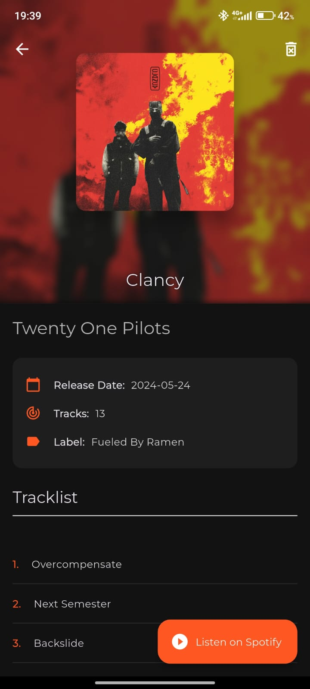
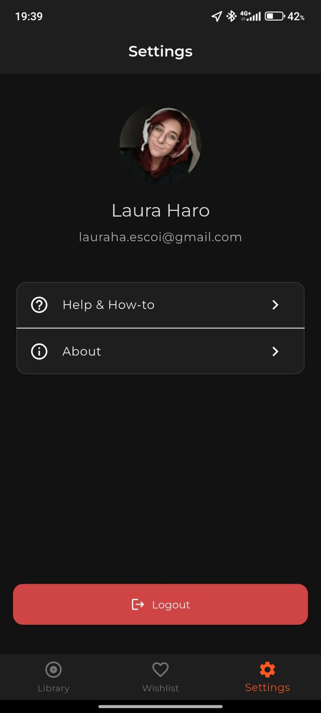

# 🎵 CD Tracker

  
  
  **Flutter app to track your physical CD collection**
  
  
  
  
  

## ✨ Features

- 🔍 **Search Albums**: Browse and search for any album using the Spotify Web API
- 📚 **Personal Library**: Keep track of your physical CD collection with album artwork
- 📝 **Wishlist**: Create a wishlist for albums you want to buy
- 📱 **Cross-platform**: Works on iOS, Android, macOS, Windows, and Web
- 🔐 **Secure Authentication**: Google Sign-In integration via Firebase
- ☁️ **Cloud Sync**: Your data is synced across all your devices
- 🎯 **Drag & Drop**: Reorder your collection as you like

## 📱 Screenshots

| Login | Search | Library | Wishlist |
|-------|--------|---------|----------|
|  |  |  |  |

| Album Details | Settings |
|---------------|----------|
|  |  |

## 🚀 Getting Started

### Prerequisites

- **Flutter SDK**: [Install Flutter](https://flutter.dev/docs/get-started/install) (version 3.8.1 or higher)
- **Firebase Account**: Create a project at [Firebase Console](https://console.firebase.google.com)
- **Spotify Developer Account**: Register at [Spotify Developer Dashboard](https://developer.spotify.com)

### Setup Instructions

For detailed setup instructions, please refer to the [SETUP.md](SETUP.md) file.

## 📝 License

This project is licensed under the MIT License - see the [LICENSE](LICENSE) file for details.

## 👩‍💻 Author

**Laura Haro Escoi** 🤠

- GitHub: [@lauraharoescoi](https://github.com/lauraharoescoi)
- LinkedIn: [Connect with me](https://www.linkedin.com/in/lauraharoescoi/)
